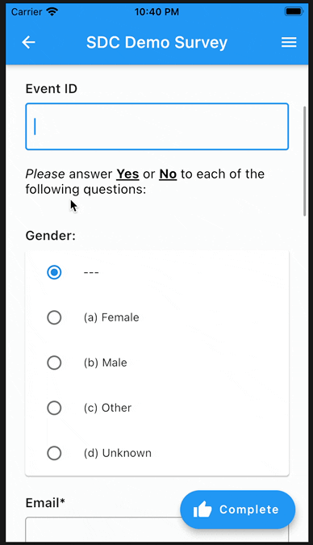

# Widgets on FHIR®
Build healthcare apps fast, using the Flutter™ SDK and following the FHIR® standard.

This is a UI add-on to the pure Dart "fhir" libraries: https://pub.dev/packages/fhir

### Support for the FHIR specification
Support is currently focussed on FHIR R4.

### Features
#### Minor things
* Formatted output of dates / times
* Formatted output of observations

#### The Major Thing: Filler widget for Questionnaires

Supports numerous features from Questionnaire and SDC profile.

**Click link below for narrated longer video**

[Demo Video](https://github.com/tiloc/fire_widgets/blob/f53a13cbecb707c51534b4bacdd52d72be291506/doc/movies/sdc-example.mp4)

### Disclaimers
Flutter and the related logo are trademarks of Google LLC. We are not endorsed by or affiliated with Google LLC.

HL7, FHIR and the FHIR [FLAME DESIGN] are the registered trademarks of Health Level Seven International and their use does not constitute endorsement by HL7.

This material contains content from LOINC (http://loinc.org). LOINC is copyright © 1995-2020, Regenstrief Institute, Inc. and the Logical Observation Identifiers Names and Codes (LOINC) Committee and is available at no cost under the license at http://loinc.org/license. LOINC® is a registered United States trademark of Regenstrief Institute, Inc.
