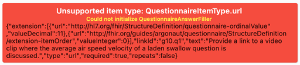

## Overview
*Faiadashu FHIRDash* is a collection of Widgets that allow for the fast creation of healthcare apps based on the Flutter framework.

## Installation
Follow the instructions on pub.dev: https://pub.dev/packages/faiadashu/install

## Prerequisites / Assumptions
The library is trying to make as few assumptions as possible about its operating environment.

### Supported versions of Flutter™ SDK
This library depends on Flutter™ SDK 2.0, or later. It is null-safe. It cannot be used with earlier versions of the SDK.

### Support for the FHIR Standard
Faiadashu FHIRDash focuses on the user interface. The underlying data models and specifications are adopted from the FHIR standard and
the FHIRFLI 'fhir' library.

[](https://pub.dev/packages/fhir)
https://pub.dev/packages/fhir

Support for the FHIR Standard is focussed on the R4 release which is located here: [](https://hl7.org/fhir/R4/)  https://hl7.org/fhir/R4/

### Theme
Theme - including text and colors - is obtained through the Material theme of the app. Both dark and light schemes work.

### Locale
Locale is obtained through `Localizations.localeOf(context)`

### Logging
The library is logging through the 'logging' package: https://pub.dev/packages/logging
This will not result in any actual logging, unless you register a logger in your app.

### State-handling
The library does not make any assumptions about the presence of a state-handling framework,
such as Redux, GetX, Provider, Riverpod, Bloc/Cubit... It only uses basic mechanisms from the
Flutter SDK (StatefulWidget, ValueNotifier) and should be interoperable with any of these.  

### Persistence
The library does not persist anything. It is up to your app to obtain persisted information and to persist the output
of the library as you see fit. See the sections on the individual use-cases for integration points.

The FHIRFLI `fhir_db` package is compatible with the `fhir` library which is underlying this library: https://pub.dev/packages/fhir_db  

### Communication
The library does not communicate to servers. It is up to your app to obtain remoted information and to send the output
of the library as you see fit. See the sections on the individual use-cases for integration points.

The FHIRFLI `fhir_at_rest` package is compatible with the `fhir` library which is underlying this library: https://pub.dev/packages/fhir_at_rest

Communication might require authentication. The FHIRFLI `fhir_auth` package is compatible with the `fhir` library which is underlying this library: https://pub.dev/packages/fhir_auth

### Use-Case: Display an Observation
```dart
final bpObservation = Observation(...); // Construct your FHIR Observation here.

return ObservationWidget(
        bpObservation,
        valueStyle: Theme.of(context).textTheme.headline4,
        codeStyle: Theme.of(context).textTheme.subtitle2,
        dateTimeStyle: Theme.of(context).textTheme.caption,
      );
```

### Use-Case: Fill a Questionnaire
#### Capabilities
The Questionnaire Filler widget is based on a specification called Structured Data Capture (SDC).

[The capabilities of this widget are documented here](sdc-capabilities.md).

Information on Structured Data Capture can be found here: 
* [SDC Home Page](http://hl7.org/fhir/uv/sdc/2019May/)
* [YT Video from FHIR DevDays](https://www.youtube.com/watch?v=WPudaF4S7Bk)
* There is a chat channel at https://chat.fhir.org stream `#questionnaire`.


#### Code example
The display and filling of a Questionnaire is entirely self-contained. You create the widget to fill a Questionnaire,
return it as part of your `build()` method and lean back.

```dart
final widget = QuestionnaireScrollerPage(
                          AssetResourceProvider.singleton(Questionnaire,
                              'assets/instruments/sdc_demo.json'),
                          resourceProvider: resourceProvider,
                          floatingActionButton: fab);
```

#### Flavors
The filler widget comes in two flavors:
* `QuestionnaireScrollerPage`: A vertically scrolling filler
* `QuestionnaireStepperPage`: A side-ways, wizard-style filler

Both of these flavors will take over the entire screen and bring their own Scaffold. An embeddable filler is contained in
`QuestionnaireFiller`. This will return a list of Widgets - one for each question - that can be used for arbitrary UI designs.

#### Integration points
The main integration point is the `ResourceProvider` which is being used by the library to obtain
content, such as the actual questionnaire, or the referenced ValueSets.

A ResourceProvider is a very simple, asynchronous mapping-mechanism from URIs to Resources. The library is providing
a set of reference implementations, but it is very easy to implement your own provider, based on your required
sources of information (web-server, EMR, file system,...).

##### Questionnaire
The library is looking for the Questionnaire under the URI 'Questionnaire'.

##### ValueSets and CodeSystems
The library is looking for the ValueSets and CodeSystems under the URI through which they are referenced.

##### QuestionnaireResponse
The current state of the questionnaire can be compiled into a QuestionnaireResponse at any time through the following code:
```dart
final response = QuestionnaireFiller.of(context)
  .aggregator<QuestionnaireResponseAggregator>()
    .aggregate(locale);
```

##### URL launching
It is up to the finished application if and how it wants to launch external URLs. The SDK offers an integration point
through the `onLinkTap` function which is called every time a user taps a link - a `supportLink` for instance.

The example app illustrates how to use the popular [url_launcher](https://pub.dev/packages/url_launcher) package to implement this.

--------------------

When using `url_launcher` it is important to follow the native setup instructions for iOS and Android 11.

--------------------

```dart
final widget = QuestionnaireScrollerPage(
    AssetResourceProvider.singleton(Questionnaire,
        'assets/instruments/sdc_demo.json'),
    resourceProvider: resourceProvider,
    floatingActionButton: fab,
    onLinkTap: (context, url) async {
      if (await canLaunch(url.toString())) {
        if (url.scheme == 'https') {
          await launch(url.toString(),
              forceWebView: true,
              enableJavaScript: true);
        } else {
          await launch(
            url.toString(),
          );
        }
      } else {
        throw 'Could not launch $url';
      }
    }
);
```

##### Error handling
###### During initialization
A `QuestionnaireFormatException` is thrown.

###### During filling
The filler will display informative error boxes.


