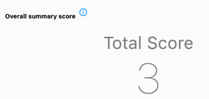

## Structured Data Capture (SDC) Capabilities
The Form Filler is based on a specification called [Structured Data Capture (SDC)](https://hl7.org/fhir/uv/sdc/2019May/index.html).

Information on Structured Data Capture can be found here:
* [SDC Home Page](https://hl7.org/fhir/uv/sdc/2019May/)
* [YT Video from FHIR DevDays](https://www.youtube.com/watch?v=WPudaF4S7Bk)
* There is a chat channel at https://chat.fhir.org stream `#questionnaire`.

**Click this video to watch the capabilities in action**

[](https://www.youtube.com/watch?v=k9vEy9Z_L18 "Walk-through of the Capabilities")

### Advanced Behavior
#### Expressions
Only expressions of type `text/fhirpath` are supported.
> FHIRPath support in Faiadashu is *highly experimental* and uses [fhir_path](https://pub.dev/packages/fhir_path) as its
> underlying implementation. See the [fhir_path documentation](https://pub.dev/packages/fhir_path) for capabilities and
> limitations.

### Advanced Rendering
#### rendering-style
Support for colors. Usable in many places (title, text, option) as permitted by the specification.


#### rendering-xhtml
Comprehensive support for fonts, style, and colors. No support for tables or lists.
Usable in many places (title, text, option) as permitted by the specification.


#### help
Display items with itemControl `help` are associated with the proper question and display a help dialog.

#### supportLink
Support links are recognized and visualized. The particular action behind them is determined through an
integration point of the SDK.


#### displayCategory
Supports `security` and `instructions`.


#### optionalDisplay
The filler never chooses to omit a field from display.

#### hidden
Supported


### Item types: Grouping
#### group
Supported, but no support for item-control.

### Item types: Static display
### display
Supported for styled static output.

### Item types: Questions
#### All types
##### required
Supported. Renders a '*' after the label

##### repeats
Only supported for `choice`

##### readOnly
Supported.

#### enableWhen
Support for all behaviors: `any`, `all`

Limited support for operators:
* `=` only on coding 
* `exists` on all types
* All other operators: always return true, as to not prevent filling of the questionnaire.

#### boolean
Comprehensive support, incl. tri-state for "not answered"

See: http://build.fhir.org/questionnaire.html#booleans for a discussion of tri-state.

#### quantity
Comprehensive support.

Special support for read-only display of total score.

Quantity requires the declaration of units. It does not support free-text entry for units.

##### Extensions
- entryFormat
- minValue
- maxValue
- maxDecimalPlaces
- questionnaire-itemControl: slider
- sliderStepValue
- unitValueSet
- unit
- [sdc-questionnaire-enableWhenExpression](http://build.fhir.org/ig/HL7/sdc/StructureDefinition-sdc-questionnaire-enableWhenExpression.html)


#### decimal
Comprehensive support.

Special support for read-only display of total score.
##### Extensions
- entryFormat
- minValue
- maxValue
- maxDecimalPlaces
- questionnaire-itemControl: slider
- sliderStepValue
- unit

#### integer
Comprehensive support

Special support for read-only display of total score.

Special support for 🇩🇰 Danish specification on patient feedback.

##### Extensions
- entryFormat
- minValue
- maxValue
- questionnaire-itemControl: slider
- sliderStepValue
- unit
- http://ehealth.sundhed.dk/fhir/StructureDefinition/ehealth-questionnaire-feedback

#### date
Comprehensive support. Date picker with localized format.
##### Extensions
- (none)

#### dateTime
Comprehensive support. Date/Time picker with localized format.
##### Extensions
- sdc-questionnaire-initialExpression

#### time
Comprehensive support. Time picker with localized format.

#### string, text 
Comprehensive support
##### Extensions
- entryFormat (use regular expressions, *not the "ANA NAN" format as seen in some examples.*)
- minLength  
- maxLength
- regex  
- questionnaire-itemControl: text-box 

#### choice
Comprehensive support, incl. optionChoice and choices from ValueSets.
Support for multiple choice (item.repeats = true) and autocomplete from ValueSets (triggered automatically by large # of choices).

Support for leaving a question unanswered.

##### Value Sets
The value set `http://hl7.org/fhir/ValueSet/yesnodontknow` is hard-coded into the library and always available.

See: http://build.fhir.org/questionnaire.html#valuesets

##### Extensions
- optionExclusive
- ordinalValue
- iso21090-CO-value
- choiceOrientation: supported, but `horizontal` may be ignored due to display constraints (mobile phone).
- questionnaire-optionPrefix: supported
- valueset-label: supported
- rendering-xhtml: in addition to regular capabilities may also contain a base64 encoded image of type PNG or JPEG. 
- questionnaire-itemControl: check-box, radio-button, autocomplete
- translation: option choices can be translated using the FHIR translation mechanism
- minOccurs
- maxOccurs

#### open-choice 
Same as `choice` with the following differences:
- repeats is not supported
- a single text input field labeled 'Other' is presented below the selections

#### url
Supported (accepts http, https, ftp, and sftp)

#### attachment, reference
Not supported


### Scoring
Ability to add up the ordinalValue or iso21090-CO-value of all choice questions into a total score.



Total score will be entered into any field which meets one of the following:
- has extension `sdc-questionnaire-calculatedExpression` with valueExpression.expression = `answers().sum(value.ordinal())`.
- is readOnly and has extension `http://hl7.org/fhir/StructureDefinition/questionnaire-unit` with *display* value = `{score}`

> The well-known [NLM Form Builder](https://lhcformbuilder.nlm.nih.gov) will set the `questionnaire-unit` extension 
> to `{score}`, but will not set the item to `readOnly`. Setting this manually to `true` will result in a questionnaire
> with fully functioning scoring.

> Scoring is hard-coded and does not offer actual support for a `valueExpression` based on FHIRPath.

### Response creation

#### Reference to Questionnaire
A canonical reference to the questionnaire will be generated, including a version number.

The optional `http://hl7.org/fhir/StructureDefinition/display` extension will be set when the questionnaire has a title.

#### Status
Status can be set to any of the supported values. Setting the status to `complete` discards items which are not enabled.

#### Authored
Will be set to the current time.

#### Narrative
A narrative will be auto-generated. Its status will be `generated`. Empty narratives will be omitted entirely.

#### Subject
A reference to the subject will be added if a subject with an `id` is present. The SDK can be requested to place the
entire `Patient` into the `contained` section of the QuestionnaireResponse.

#### Answers
All detail from the questions in the questionnaire carries over into the Response.

Choice answers will be marked as "user selected".

#### Example QuestionnaireResponse
```json
{
  "resourceType": "QuestionnaireResponse",
  "text": {
    "status": "generated",
    "div": "<div xmlns=\"http://www.w3.org/1999/xhtml\"><h3>Over the past 2 weeks, how much has your heart failure limited your enjoyment of life?</h3><p>It has moderately limited my enjoyment of life</p><h3>Overall summary score</h3><p>3 {score}</p></div>"
  },
  "status": "unknown",
  "authored": "2021-04-03T17:49:47.261704",
  "item": [
    {
      "linkId": "/hfcode-923-0",
      "text": "Please indicate how much you are limited by <b>heart failure</b> (<i>shortness of breath or fatigue</i>) in your ability to do the following activities over the past 2 weeks.",
      "item": [
        {
          "linkId": "/hfcode-IV88-IV",
          "text": "Over the past 2 weeks, how much has your heart failure limited your enjoyment of life?",
          "answer": [
            {
              "valueCoding": {
                "extension": [
                  {
                    "url": "http://hl7.org/fhir/StructureDefinition/iso21090-CO-value",
                    "valueDecimal": 3
                  }
                ],
                "code": "CODE-II-7747-7",
                "display": "It has moderately limited my enjoyment of life",
                "userSelected": true
              }
            }
          ]
        },
        {
          "linkId": "/hfcode-924-8",
          "text": "Overall summary score",
          "answer": [
            {
              "valueQuantity": {
                "value": 3,
                "unit": "{score}"
              }
            }
          ]
        }
      ]
    }
  ]
}
```

## Support for other Implementation Guides
### Argonaut
[Argonaut](http://fhir.org/guides/argonaut/questionnaire/index.html) is a subset of SDC and based on FHIR R3. The Form Filler is based on FHIR R4, which inherently makes it non-conformant
to Argonaut. It does fill all the corresponding mandatory fields in the R4 QuestionnaireResponse.

### FHIR Clinical Guidelines (CPG IG)
[CPG](http://build.fhir.org/ig/HL7/cqf-recommendations/index.html) is generally not supported by this Form Filler.

It does support select extensions for visual control:
#### itemImage
An image to display as a visual accompaniment to the question being asked.

This extension can be applied to question items.

